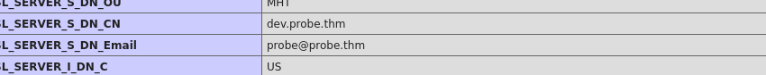

#### *What is the version of the Apache server?*

Ran a basic nmap script to enumerate the ports and services. 
```console
nmap -A -sV 10.10.197.64 -oN probe_nmap.txt
```
The result was as follows:
```console
┌──(roshan㉿redhood)-[~/Downloads/THM/probe]
└─$ nmap -A -sV 10.10.197.64 -oN probe_nmap.txt 
Starting Nmap 7.94 ( https://nmap.org ) at 2024-01-13 14:58 +08
Stats: 0:00:12 elapsed; 0 hosts completed (1 up), 1 undergoing Connect Scan
Connect Scan Timing: About 48.24% done; ETC: 14:58 (0:00:12 remaining)
Nmap scan report for 10.10.197.64
Host is up (0.20s latency).
Not shown: 995 closed tcp ports (conn-refused)
PORT     STATE SERVICE  VERSION
22/tcp   open  ssh      OpenSSH 8.2p1 Ubuntu 4ubuntu0.7 (Ubuntu Linux; protocol 2.0)
| ssh-hostkey: 
|   3072 8e:c7:c5:31:33:69:3c:c2:96:a2:56:fc:08:47:82:bd (RSA)
|   256 79:0f:48:7f:de:8e:42:aa:c3:fb:fe:88:03:88:12:da (ECDSA)
|_  256 bd:98:00:fb:71:d5:25:89:e8:54:8d:7a:35:0e:0b:f1 (ED25519)
80/tcp   open  http     lighttpd 1.4.55
|_http-title: 403 Forbidden
|_http-server-header: lighttpd/1.4.55
443/tcp  open  ssl/http Apache httpd 2.4.41
|_http-title: 403 Forbidden
|_ssl-date: TLS randomness does not represent time
| ssl-cert: Subject: commonName=dev.probe.thm/organizationName=Tester/stateOrProvinceName=Some-State/countryName=US
| Not valid before: 2023-07-18T10:57:05
|_Not valid after:  2024-07-17T10:57:05
|_http-server-header: Apache/2.4.41 (Ubuntu)
| tls-alpn: 
|_  http/1.1
1338/tcp open ftp vsftpd 2.0.8 or later
1443/tcp open  ssl/http Apache httpd 2.4.41 ((Ubuntu))
|_http-title: PHP 7.4.3-4ubuntu2.19 - phpinfo()
| tls-alpn: 
|_  http/1.1
|_http-server-header: Apache/2.4.41 (Ubuntu)
|_ssl-date: TLS randomness does not represent time
| ssl-cert: Subject: commonName=dev.probe.thm/organizationName=Tester/stateOrProvinceName=Some-State/countryName=US
| Not valid before: 2023-07-18T10:57:05
|_Not valid after:  2024-07-17T10:57:05
8000/tcp open  http     Apache httpd 2.4.41 ((Ubuntu))
|_http-open-proxy: Proxy might be redirecting requests
|_http-title: Site doesn't have a title (text/html; charset=UTF-8).
|_http-server-header: Apache/2.4.41 (Ubuntu)
9007/tcp open http Apache httpd 2.4.41  
|_http-server-header: Apache/2.4.41 (Ubuntu)  
|_http-title: 400 Bad Request  
MAC Address: 02:33:91:AA:DE:E9 (Unknown)
Service Info: Host: ip-10-10-197-64.eu-west-1.compute.internal; OS: Linux; CPE: cpe:/o:linux:linux_kernel

Service detection performed. Please report any incorrect results at https://nmap.org/submit/ .
Nmap done: 1 IP address (1 host up) scanned in 76.15 seconds

```
##### *Answer : 2.4.41*
#### *What is the port number of the FTP service?*
```console
1338/tcp open ftp vsftpd 2.0.8 or later
```
##### *Answer : 1338*
#### *What is the FQDN of the website hosted using a self-signed certificate and contains critical server information as the homepage?*
Looking at the details under each port, I noticed that 443 and 1443 had SSL certificates. 
```console
443/tcp  open  ssl/http Apache httpd 2.4.41
|_http-title: 403 Forbidden
|_ssl-date: TLS randomness does not represent time
| ssl-cert: Subject: commonName=dev.probe.thm/organizationName=Tester/stateOrProvinceName=Some-State/countryName=US
| Not valid before: 2023-07-18T10:57:05
|_Not valid after:  2024-07-17T10:57:05
|_http-server-header: Apache/2.4.41 (Ubuntu)
| tls-alpn: 
|_  http/1.1

1443/tcp open  ssl/http Apache httpd 2.4.41 ((Ubuntu))
|_http-title: PHP 7.4.3-4ubuntu2.19 - phpinfo()
| tls-alpn: 
|_  http/1.1
|_http-server-header: Apache/2.4.41 (Ubuntu)
|_ssl-date: TLS randomness does not represent time
| ssl-cert: Subject: commonName=dev.probe.thm/organizationName=Tester/stateOrProvinceName=Some-State/countryName=US
| Not valid before: 2023-07-18T10:57:05
|_Not valid after:  2024-07-17T10:57:05


```
However, accessing through port 443 was forbidden, so I tried access through 1443. 
Note that you will have to specify the protocol to be `https` in the browser, not `http`, as this is an SSL-enabled port.
```URL
https://10.10.197.64:1443/
```
Scrolling through the webpage, you come across the Fully Qualified Domain Name of the IP. 

##### *Answer : dev.probe.thm*

#### *What is the value of the PHP Extension Build on the server?*
##### *Answer : API20190902,NTS*
#### *What is the banner for the FTP service?*

Log into the ftp server to obtain the banner:
```console
┌──(roshan㉿redhood)-[~/Downloads/THM/probe]
└─$ ftp 10.10.197.64 1338 
Connected to 10.10.197.64.
220 THM{WELCOME_101113}
Name (10.10.197.64:roshan): 
```
##### *Answer: 220 THM{WELCOME_101113}*
#### *What software is used for managing the database on the server?*

Honestly, made a educated guess, given that the server side scripting was done in php, so I tried `phpmyadmin` and it worked!
##### *Answer : phpmyadmin* 
#### *What is the Content Management System (CMS) hosted on the server?*

Searching up content management systems, I found the commonly used CMSs are WordPress, Joomia and Drupal. 
I authenticated to the IP under port 9007, landing on a blog page. 
Looking through the source code, I see the `wp.` is referenced through out the code, leading me to conclusion that the CMS is WordPress
```HTML
link rel='stylesheet' id='wp-block-navigation-css' href='https://myblog.thm:9007/wp-includes/blocks/navigation/style.min.css?ver=6.2.2' media='all' />
<style id='wp-block-navigation-inline-css'>
.wp-block-navigation{font-size: var(--wp--preset--font-size--small);}
.wp-block-navigation a:where(:not(.wp-element-button)){color: inherit;text-decoration: none;}
.wp-block-navigation a:where(:not(.wp-element-button)):hover{text-decoration: underline;}
.wp-block-navigation a:where(:not(.wp-element-button)):focus{text-decoration: underline dashed;}
.wp-block-navigation a:where(:not(.wp-element-button)):active{text-decoration: none;}
```
Alternatively, `Nikto` can be used to scan the different open ports, eventually landing on lead from port 9007.
```console
┌──(roshan㉿redhood)-[~/Downloads/THM/probe]
└─$ nikto -h https://10.10.197.64:9007
- Nikto v2.5.0
---------------------------------------------------------------------------
+ Target IP:          10.10.197.64
+ Target Hostname:    10.10.197.64
+ Target Port:        9007
---------------------------------------------------------------------------
+ SSL Info:        Subject:  /C=US/ST=Some-State/O=Internet Widgits Pty Ltd/CN=myblog.thm/emailAddress=dev@myblog.thm
                   Ciphers:  TLS_AES_256_GCM_SHA384
                   Issuer:   /C=US/ST=Some-State/O=Internet Widgits Pty Ltd/CN=myblog.thm/emailAddress=dev@myblog.thm
+ Start Time:         2024-01-13 16:28:31 (GMT8)
---------------------------------------------------------------------------
+ Server: Apache/2.4.41 (Ubuntu)
+ /: The anti-clickjacking X-Frame-Options header is not present. See: https://developer.mozilla.org/en-US/docs/Web/HTTP/Headers/X-Frame-Options
+ /: Drupal Link header found with value: <https://myblog.thm:9007/index.php?rest_route=/>; rel="https://api.w.org/". See: https://www.drupal.org/
+ /: The site uses TLS and the Strict-Transport-Security HTTP header is not defined. See: https://developer.mozilla.org/en-US/docs/Web/HTTP/Headers/Strict-Transport-Security
+ /: The X-Content-Type-Options header is not set. This could allow the user agent to render the content of the site in a different fashion to the MIME type. See: https://www.netsparker.com/web-vulnerability-scanner/vulnerabilities/missing-content-type-header/
+ /index.php?: Uncommon header 'x-redirect-by' found, with contents: WordPress.
+ No CGI Directories found (use '-C all' to force check all possible dirs)
```

##### *Answer :* WordPress
#### *What is the version number of the CMS hosted on the server?*

In the source code of the same site, I searched `ver` using the find (ctrl+F) tool. This was the result: 
```HTML
.."https:\/\/myblog.thm:9007\/wp-includes\/js\/wp-emoji-release.min.js?ver=6.2.2"}};
```
##### *Answer :* 6.2.2
#### *What is the username for the admin panel of the CMS?*

Ran `wpscan` since it is using WordPress, with the following tags : 
`wpscan --url https://10.10.197.64:9007 --disable-tls-checks -e - u`

This was the result: 
```console
 |  - https://10.10.197.64:9007/wp-content/themes/twentytwentythree/style.css, Match: 'Version: 1.1'

[+] Enumerating Users (via Passive and Aggressive Methods)
 Brute Forcing Author IDs - Time: 00:00:02 <========================================> (10 / 10) 100.00% Time: 00:00:02

[i] User(s) Identified:

[+] joomla
 | Found By: Author Id Brute Forcing - Author Pattern (Aggressive Detection)
 | Confirmed By: Login Error Messages (Aggressive Detection)


```
##### *Answer : joomla* 

#### *During vulnerability scanning, OSVDB-3092 detects a file that may be used to identify the blogging site software. What is the name of the file?*

I learnt that `nikto` runs OSVDB-3092 by default. Running it again, we get the following related information:
```console
+ Cookie back_https created without the httponly flag  
+ /wp-links-opml.php: This WordPress script reveals the installed version.  
+ OSVDB-3092: /license.txt: License file found may identify site software.  
+ /: A Wordpress installation was found.
```
##### *Answer: license.txt*
#### *What is the name of the software being used on the standard HTTP port?*
Looking at the previous `nmap` scan, we see what is running on port 80 : 
```console
80/tcp   open  http     lighttpd 1.4.55
```
##### *Answer : lighttpd*

#### *What is the flag value associated with the web page hosted on port 8000?*
Used dirbuster to enumerate any hidden directories since the default page and its source code is empty:
```console
┌──(roshan㉿redhood)-[~/Downloads/THM/probe]
└─$ gobuster dir -u http://10.10.197.64:8000 -w /usr/share/wordlists/dirbuster/directory-list-2.3-medium.txt 
===============================================================
Gobuster v3.5
by OJ Reeves (@TheColonial) & Christian Mehlmauer (@firefart)
===============================================================
[+] Url:                     http://10.10.197.64:8000
[+] Method:                  GET
[+] Threads:                 10
[+] Wordlist:                /usr/share/wordlists/dirbuster/directory-list-2.3-medium.txt
[+] Negative Status codes:   404
[+] User Agent:              gobuster/3.5
[+] Timeout:                 10s
===============================================================
2024/01/13 17:09:41 Starting gobuster in directory enumeration mode
===============================================================
/contactus            (Status: 301) [Size: 323] [--> http://10.10.197.64:8000/contactus/]
/javascript           (Status: 301) [Size: 324] [--> http://10.10.197.64:8000/javascript/]

```

Accessed `/contactus` to see if there is anything, and sure enough, there is! 
`Flag: THM{CONTACT_US_1100}`

##### *Answer : THM{CONTACT_US_1100}*
